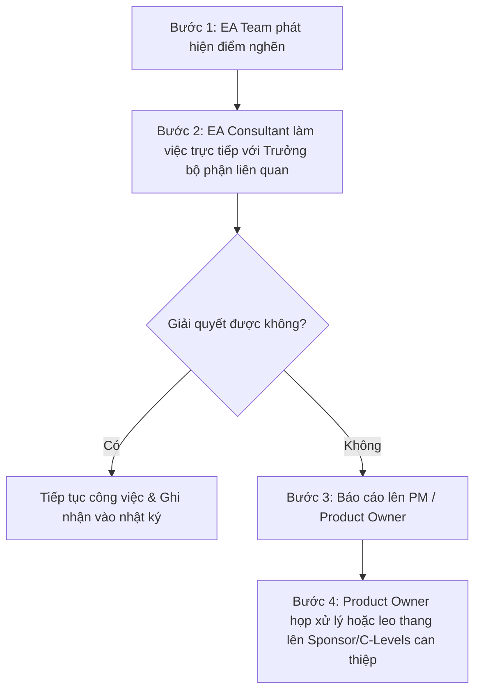

# Kế hoạch Truyền thông Dự án Baseline Kiến trúc Dữ liệu - FPT Long Châu

Tài liệu này xác định cách thức giao tiếp, trao đổi thông tin, tần suất các cuộc họp nghiệp vụ/kiến trúc và các kênh truyền thông được sử dụng trong suốt chiến dịch khảo sát hiện trạng dữ liệu tại FPT Long Châu.

---

## 1. Nguyên tắc Truyền thông Cốt lõi
- **Chính xác & Rõ ràng**: Thông tin truyền đạt phải rõ nghĩa, có cấu trúc tốt, có số liệu/dẫn chứng kỹ thuật cụ thể.
- **Bảo mật tối đa**: Không chia sẻ thông tin kiến trúc hạ tầng nhạy cảm, schema database hoặc bất kỳ tài liệu nào của dự án lên các kênh chat công cộng hoặc email cá nhân.
- **Tính Kịp thời**: Báo cáo tiến độ hoặc các điểm nghẽn (Pain points) cần được phản ánh sớm để có biện pháp can thiệp.

---

## 2. Kênh Truyền thông & Công cụ

| Công cụ / Kênh | Mục đích | Đối tượng áp dụng | Nguyên tắc bảo mật |
| :--- | :--- | :--- | :--- |
| **Microsoft Teams / Slack** | Trao đổi nhanh hàng ngày, phối hợp công việc kỹ thuật, giải đáp thắc mắc ngắn. | Ban dự án (EA Team, DBA, Engineers) | Chỉ sử dụng tài khoản doanh nghiệp. Không thảo luận các chi tiết cực kỳ nhạy cảm liên quan đến lỗ hổng bảo mật. |
| **SharePoint / OneDrive (MFA)** | Lưu trữ và chia sẻ tài liệu khảo sát, tài liệu thiết kế sơ đồ, từ điển dữ liệu, file excel. | Ban dự án & Stakeholders liên quan | Yêu cầu đăng nhập bằng email doanh nghiệp, kích hoạt xác thực đa yếu tố (MFA). Thiết lập phân quyền truy cập (Read-only / Edit) cụ thể cho từng thư mục. |
| **Multica Platform** | Quản lý công việc (WBS), cập nhật trạng thái Task/Issue, lưu trữ kết quả và bình luận trao đổi chính thức của dự án. | Ban dự án & Product Owner (Khanh Hoa) | Toàn bộ kết quả đầu ra chính thức của từng WP phải được đính kèm hoặc dẫn link trong issue tương ứng trên Multica. |
| **Email Công việc** | Gửi thông báo chính thức, gửi thư mời họp, báo cáo tuần/tháng đến Ban chỉ đạo và C-Levels. | Toàn bộ Stakeholders | Chỉ dùng email tên miền `@fpt.com` hoặc `@longchau.com`. |

---

## 3. Lịch trình Họp và Sự kiện Định kỳ

| Tên Cuộc họp | Tần suất | Mục đích | Người tham dự chủ trì | Người tham dự khác | Đầu ra mong đợi |
| :--- | :--- | :--- | :--- | :--- | :--- |
| **Kickoff Meeting** | 1 lần duy nhất | Khởi động dự án, công bố mục tiêu, thống nhất kế hoạch (WP1). | EA Consultant (Leader) | Toàn bộ Ban dự án & Stakeholders | Slide khởi động được duyệt, biên bản kickoff. |
| **Weekly Project Sync** | Hàng tuần (Chiều thứ 6) | Đánh giá tiến độ các WP, giải quyết các khó khăn kỹ thuật, điều phối lịch phỏng vấn tuần tới. | EA Consultant | EA Team (DA, DE, Security) | Báo cáo tuần (Weekly Status), cập nhật bảng theo dõi rủi ro. |
| **Steering Committee Sync** | 2 tuần một lần (Bi-weekly) | Báo cáo tiến độ tổng thể lên PO/Sponsor, xin ý kiến chỉ đạo đối với các điểm nghẽn hoặc thay đổi phạm vi. | EA Consultant | Product Owner, Sponsor, CIO/COO | Biên bản họp, quyết định chỉ đạo từ PO/Sponsor. |
| **Workshop Khảo sát Nghiệp vụ** | Theo kế hoạch phỏng vấn | Phỏng vấn sâu các bộ phận nghiệp vụ (POS, WMS, CRM, ERP) để nắm bắt quy trình và nguồn dữ liệu. | Data Architect / EA Consultant | Key Users nghiệp vụ, Data Owners | Biên bản phỏng vấn, sơ đồ luồng dữ liệu nghiệp vụ nháp. |
| **Workshop Soát xét Baseline** | 1-2 buổi cuối dự án | Soát xét toàn bộ tài liệu hiện trạng dữ liệu và sơ đồ kiến trúc trước khi phê duyệt chính thức (WP9). | EA Consultant | Toàn bộ Ban dự án & Stakeholders | Biên bản đánh giá, chữ ký phê duyệt tài liệu Baseline. |

---

## 4. Quy trình Báo cáo Tiến độ (Status Reporting)
- **Tần suất**: Cuối mỗi chiều thứ Sáu hàng tuần.
- **Người thực hiện**: EA Consultant tổng hợp thông tin từ Data Architect, Data Engineer và Security Architect.
- **Người nhận**: Product Owner (Khanh Hoa).
- **Hình thức**: Cập nhật trực tiếp lên issue cha `KHB-9` (hoặc comment trên các issue con đang chạy) và gửi email tóm tắt.
- **Nội dung báo cáo**:
  1. Các công việc đã hoàn thành trong tuần.
  2. Các công việc dự kiến triển khai trong tuần tới.
  3. Trạng thái tiến độ thực tế so với kế hoạch (On track / Delayed).
  4. Các rủi ro/điểm nghẽn cần PO hoặc bộ phận khác hỗ trợ giải quyết.

---

## 5. Quy trình Leo thang Giải quyết Vấn đề (Escalation Path)
Khi xảy ra các điểm nghẽn cản trở tiến độ khảo sát (ví dụ: bộ phận nghiệp vụ liên tục trì hoãn phỏng vấn, DBA từ chối cung cấp siêu dữ liệu), quy trình leo thang sẽ được thực hiện như sau:

