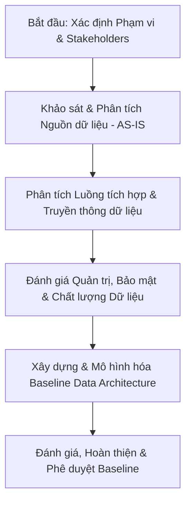

# Kế hoạch Khảo sát và Xây dựng Kiến trúc Dữ liệu Hiện trạng (Baseline Data Architecture) - FPT Long Châu

Tài liệu này trình bày kế hoạch chi tiết cho hoạt động khảo sát, thu thập thông tin và xây dựng bản kiến trúc dữ liệu hiện tại (AS-IS/Baseline Data Architecture) của FPT Long Châu. Hoạt động này được thiết kế theo phương pháp luận **TOGAF ADM (Phase C - Information Systems Architecture: Data Architecture)** và sử dụng chuẩn mô hình hóa **ArchiMate 3.x** để trực quan hóa cấu trúc dữ liệu, luồng thông tin và mối liên kết giữa dữ liệu với quy trình nghiệp vụ và hạ tầng công nghệ.

---

## 1. Mục tiêu và Phạm vi Khảo sát

### 1.1. Mục tiêu
- **Xác định và phân loại toàn bộ nguồn dữ liệu**: Định vị các kho dữ liệu, cơ sở dữ liệu ứng dụng nghiệp vụ, dữ liệu phân tích và các nguồn dữ liệu bên ngoài.
- **Phân loại dữ liệu & Đánh giá tuân thủ**: Xác định và phân loại dữ liệu theo mức độ nhạy cảm (Public, Internal, Confidential, Restricted). Đặc biệt tập trung nhận diện các vùng lưu trữ Dữ liệu Cá nhân (bao gồm dữ liệu cá nhân cơ bản và dữ liệu cá nhân nhạy cảm như thông tin đơn thuốc, thông tin bệnh lý của khách hàng) để đảm bảo tuân thủ nghiêm ngặt Nghị định 13/2023/NĐ-CP.
- **Lập bản đồ luồng thông tin (Data Flow & Lineage)**: Làm rõ cách thức dữ liệu được tạo ra, luân chuyển, biến đổi và tiêu thụ giữa các hệ thống cốt lõi tại Long Châu.
- **Đánh giá hoạt động quản lý dữ liệu (Data Activities & Management)**: Khảo sát quy trình quản trị dữ liệu (Data Governance), chất lượng dữ liệu (Data Quality), bảo mật dữ liệu (Data Security - các cơ chế mã hóa, che giấu dữ liệu/masking, kiểm soát truy cập IAM, ghi log kiểm toán/audit logging), và vòng đời dữ liệu (Data Lifecycle).
- **Thiết lập Baseline Kiến trúc Dữ liệu**: Xây dựng kho tài liệu hiện trạng chuẩn hóa để làm cơ sở đối chiếu cho việc thiết kế kiến trúc mục tiêu (Target Architecture) và phân tích khoảng trống (Gap Analysis).

### 1.2. Phạm vi khảo sát
- **Về mặt Nghiệp vụ**: Tập trung vào các quy trình nghiệp vụ sinh dữ liệu lớn và cốt lõi: Bán hàng (POS), Chuỗi cung ứng & Kho vận (WMS, Logistics), Chăm sóc khách hàng & Trung thành (CRM, CDP), Mua hàng & Quản lý sản phẩm (ERP), và Bán hàng đa kênh (Omnichannel/E-commerce).
- **Về mặt Hệ thống (Ứng dụng)**: Khảo sát các hệ thống ERP, POS, WMS, CRM, CDP, Data Lakehouse/Data Warehouse (DWH), và các hệ thống vệ tinh.
- **Về mặt Dữ liệu**: Khảo sát cấu trúc bảng (Schema), từ điển dữ liệu (Data Dictionary), siêu dữ liệu (Metadata), phân loại mức độ bảo mật dữ liệu, cơ chế quản lý sự đồng ý của khách hàng (Consent management), chính sách bảo mật/quyền truy cập, cơ chế ghi log nghiệp vụ và quy chuẩn chất lượng dữ liệu.

---

## 2. Phương pháp tiếp cận (Methodology)

Kế hoạch khảo sát áp dụng khung **TOGAF ADM Phase C (Data Architecture)** để đảm bảo tính toàn diện và có hệ thống:

Để trực quan hóa kiến trúc hiện tại, chúng tôi sử dụng mô hình hóa **ArchiMate 3.x** trên 3 phân lớp chính liên quan đến dữ liệu:
1. **Business Layer**: Xác định các Đối tượng dữ liệu nghiệp vụ (Business Objects) gắn liền với Quy trình nghiệp vụ (Business Processes) và Vai trò nghiệp vụ (Business Roles).
2. **Application Layer**: Xác định các Thành phần ứng dụng (Application Components) quản lý dữ liệu, các Dịch vụ ứng dụng (Application Services) cung cấp dữ liệu, và các Đối tượng dữ liệu ứng dụng (Data Objects) tương ứng.
3. **Technology Layer**: Xác định Hạ tầng công nghệ (Nodes, Devices, System Software, Technology Interfaces) nơi lưu trữ vật lý và xử lý dữ liệu.

---

## 3. Danh sách các Đầu việc chính (WBS - Work Breakdown Structure)

Dưới đây là bảng phân rã công việc chi tiết cho chiến dịch khảo sát:

| Mã đầu việc | Tên Đầu việc / Hoạt động | Mô tả chi tiết | Đầu vào (Inputs) | Đầu ra (Outputs) | Vai trò chịu trách nhiệm |
| :--- | :--- | :--- | :--- | :--- | :--- |
| **WP1** | **Chuẩn bị & Khởi động dự án** | Thiết lập ban dự án, xác định stakeholders và thống nhất kế hoạch làm việc. | Đề bài dự án, Sơ đồ tổ chức Long Châu | Slide khởi động, Kế hoạch khảo sát được phê duyệt, Kế hoạch truyền thông | EA Consultant (Leader), Project Sponsor |
| **WP2** | **Xác định & Lập bản đồ Stakeholders (RACI)** | Xác định các bên liên quan cốt lõi sở hữu (Data Owners) và vận hành dữ liệu (Data Stewards/Engineers). | Sơ đồ tổ chức, Danh sách phòng ban | Ma trận RACI dự án dữ liệu, Danh sách đầu mối liên hệ | EA Consultant, PM |
| **WP3** | **Khảo sát Danh mục Hệ thống & Nguồn dữ liệu** | Thu thập thông tin về các ứng dụng hiện có, cơ sở dữ liệu vật lý (SQL, NoSQL), các file lưu trữ và dữ liệu ngoại vi. | Tài liệu kiến trúc ứng dụng hiện có (nếu có), Sơ đồ mạng | Danh mục hệ thống & Nguồn dữ liệu (Data Inventory Matrix) | Data Architect, System Admin, DBAs |
| **WP4** | **Khảo sát Cấu trúc, Từ điển & Phân loại Dữ liệu** | Thu thập Schema, Metadata, Data Dictionary của các hệ thống lõi. Định vị, phân loại các trường thông tin nhạy cảm và Dữ liệu cá nhân (Basic vs. Sensitive Personal Data). | Database Schemas, Tài liệu đặc tả kỹ thuật hệ thống | Danh mục Thực thể Dữ liệu (Data Entity Catalog), Từ điển Dữ liệu và Bản phân loại bảo mật | Data Architect, Database Developers, Security Specialist |
| **WP5** | **Khảo sát Luồng thông tin & Tích hợp (Data Integration & Lineage)** | Tìm hiểu cách thức dữ liệu di chuyển giữa các hệ thống (Real-time APIs, Batch Jobs, ETL, Message Queues). | Cấu hình ETL, Tài liệu API, Tài liệu tích hợp hệ thống | Sơ đồ luồng dữ liệu (Data Flow Diagrams), Bản đồ tích hợp (Integration Map) | Integration Architect, Data Engineers |
| **WP6** | **Đánh giá Bảo mật, Quản trị & Tuân thủ Nghị định 13** | Khảo sát các cơ chế an toàn dữ liệu hiện tại (mã hóa, data masking, access control, audit log) và đánh giá khoảng trống tuân thủ Nghị định 13/2023/NĐ-CP (Consent, quyền chủ thể, DPIA). | Quy định bảo mật thông tin, Chính sách IT, Quy trình xử lý sự cố dữ liệu | Báo cáo Đánh giá An toàn thông tin, Quản trị Dữ liệu & Tuân thủ Nghị định 13 | Security Specialist, Data Governance Officer, Compliance/Legal |
| **WP7** | **Mô hình hóa Kiến trúc Dữ liệu Hiện trạng (ArchiMate)** | Sử dụng ArchiMate để trực quan hóa mối quan hệ giữa Nghiệp vụ - Ứng dụng - Công nghệ đối với dữ liệu. | Kết quả khảo sát từ WP3, WP4, WP5 | Sơ đồ kiến trúc ArchiMate Baseline Data (Định dạng XML/Archimate & Ảnh xuất) | EA Consultant, Data Architect |
| **WP8** | **Tổng hợp Baseline & Đánh giá Gaps ban đầu** | Đóng gói tài liệu Baseline Data Architecture và chỉ ra các điểm nghẽn (Pain points) hiện tại bao gồm các rủi ro về an toàn thông tin & tuân thủ. | Toàn bộ đầu ra từ WP3 đến WP7 | Báo cáo Kiến trúc Dữ liệu Hiện trạng (Baseline Data Architecture Document), Danh sách Điểm nghẽn | EA Consultant (Leader), Data Architect, Security Specialist |
| **WP9** | **Đánh giá & Ký duyệt Baseline** | Tổ chức các buổi workshop soát xét tài liệu với stakeholders để thống nhất và phê duyệt baseline. | Dự thảo Báo cáo Baseline | Biên bản đánh giá, Tài liệu Baseline Data Architecture được phê duyệt chính thức | EA Consultant, Stakeholders, Project Sponsor |
| **WP10** | **Đảm bảo An toàn thông tin cho Hoạt động Khảo sát** | Thiết lập các quy định an toàn thông tin trong suốt quá trình khảo sát (cấp quyền read-only, NDA, kiểm soát chia sẻ tài liệu nhạy cảm, thu hồi tài khoản). | Đề xuất quy trình khảo sát, Danh sách công cụ khảo sát | Quy trình Bảo mật Khảo sát, Nhật ký giám sát & kiểm toán khảo sát | Security Specialist, System Admin, PM |

---

## 4. Ma trận RACI cho Hoạt động Khảo sát

* **R (Responsible)**: Người thực hiện công việc trực tiếp.
* **A (Accountable)**: Người chịu trách nhiệm tối cao và phê duyệt kết quả.
* **C (Consulted)**: Người được tham vấn ý kiến.
* **I (Informed)**: Người được thông báo kết quả.

| Hoạt động khảo sát | Sponsor / C-Levels | EA Consultant | Data Architect | Data Engineer / DBA | Nghiệp vụ (Business Owners) | Security & Compliance |
| :--- | :---: | :---: | :---: | :---: | :---: | :---: |
| **WP1**: Khởi động dự án | **A** | **R** | **C** | **I** | **C** | **I** |
| **WP2**: Lập ma trận RACI & Stakeholders | **I** | **A** | **R** | **C** | **C** | **I** |
| **WP3**: Khảo sát nguồn dữ liệu vật lý | **I** | **C** | **A** | **R** | **I** | **C** |
| **WP4**: Khảo sát cấu trúc & từ điển dữ liệu | **I** | **C** | **A** | **R** | **C** | **C** |
| **WP5**: Khảo sát luồng thông tin & tích hợp | **I** | **C** | **A** | **R** | **I** | **I** |
| **WP6**: Đánh giá bảo mật, quản trị & Nghị định 13 | **C** | **C** | **R** | **C** | **C** | **A/R** |
| **WP7**: Mô hình hóa ArchiMate Baseline | **I** | **A** | **R** | **I** | **I** | **I** |
| **WP8**: Tổng hợp báo cáo Baseline & Gaps | **I** | **A** | **R** | **C** | **C** | **C** |
| **WP9**: Workshop soát xét & Ký duyệt | **A** | **R** | **C** | **C** | **C** | **C** |
| **WP10**: An toàn thông tin cho khảo sát | **I** | **C** | **C** | **C** | **I** | **A/R** |

---

## 5. Kết quả đầu ra mong đợi (Expected Deliverables)

1. **Tài liệu Báo cáo Kiến trúc Dữ liệu Hiện trạng (Baseline Data Architecture Document)**: 
   - Tổng quan về hiện trạng dữ liệu Long Châu.
   - Các nguyên tắc kiến trúc dữ liệu hiện tại (Data Architecture Principles).
   - Danh sách các thực thể dữ liệu nghiệp vụ chính và từ điển định nghĩa.
   - Bản đồ phân loại dữ liệu bảo mật và xác định các khu vực lưu trữ Dữ liệu cá nhân (Basic & Sensitive Personal Data Map).
2. **Kho sơ đồ Kiến trúc dữ liệu Baseline (ArchiMate & DFD)**:
   - Sơ đồ Khái niệm Dữ liệu (Conceptual Data Model).
   - Sơ đồ Luồng Dữ liệu giữa các hệ thống (Application-Data Flow Diagram).
   - Sơ đồ Kiến trúc Hạ tầng Dữ liệu (Technology-Data Infrastructure Diagram) bao gồm vị trí các chốt bảo mật (firewalls, encryption boundaries).
3. **Danh mục Dữ liệu và Tích hợp (Data Inventory & Integration Catalog)**:
   - File Excel chi tiết lưu trữ danh mục các bảng dữ liệu lõi, các kết nối API, và lịch trình chạy các luồng ETL.
4. **Báo cáo Phân tích Điểm nghẽn & Rủi ro Dữ liệu (Current Data Pain Points & Compliance Risks Registry)**:
   - Liệt kê các rủi ro về chất lượng dữ liệu (dữ liệu rác, trùng lặp), điểm nghẽn tích hợp (đồng bộ chậm).
   - Báo cáo đánh giá khoảng trống tuân thủ Nghị định 13/2023/NĐ-CP (ví dụ: thiếu cơ chế rút lại sự đồng ý, thiếu mã hóa dữ liệu nhạy cảm).
5. **Quy trình An toàn thông tin và Báo cáo Giám sát Chiến dịch Khảo sát**:
   - Tài liệu đặc tả quy trình bảo vệ dữ liệu khảo sát nhạy cảm và nhật ký kiểm toán hoạt động truy cập hệ thống của đội khảo sát.

---

## 6. Kế hoạch Quản lý Rủi ro Khảo sát

| STT | Rủi ro tiềm ẩn | Mức độ ảnh hưởng | Giải pháp giảm thiểu |
| :--- | :--- | :---: | :--- |
| 1 | Stakeholders nghiệp vụ/IT bận, không sắp xếp được thời gian phỏng vấn. | **Cao** | - Lên lịch khảo sát trước ít nhất 1 tuần. - Chuẩn bị sẵn bảng câu hỏi khảo sát ngắn gọn, trọng tâm thay vì họp tự do. - Nhờ Sponsor can thiệp nếu cần. |
| 2 | Thiếu tài liệu đặc tả kỹ thuật (Data Dictionary, Schema) của các hệ thống cũ/outsource. | **Trung bình** | - Sử dụng công cụ tự động reverse-engineering database schema. - Tổ chức workshop chuyên sâu với chuyên gia vận hành hệ thống đó để vẽ lại cấu trúc tối giản. |
| 3 | Rào cản về bảo mật thông tin không cho phép chia sẻ schema hoặc dữ liệu nhạy cảm. | **Cao** | - Ký cam kết bảo mật NDA chặt chẽ. - Chỉ khảo sát cấu trúc siêu dữ liệu (Metadata/Schema), tuyệt đối không thu thập hoặc xuất dữ liệu thực tế (Actual/Customer Data). |
| 4 | Phạm vi khảo sát quá rộng dẫn đến trễ tiến độ. | **Trung bình** | - Áp dụng nguyên lý Pareto (80/20): Tập trung khảo sát sâu 20% các hệ thống cốt lõi mang 80% giá trị giao dịch (POS, ERP, CRM). Các hệ thống phụ chỉ khảo sát ở mức khái quát. |
| 5 | Rò rỉ thông tin nhạy cảm về kiến trúc hệ thống (IP, Port, Schema) do tài liệu khảo sát được lưu trữ không an toàn. | **Cao** | - Lưu trữ tài liệu khảo sát trên thư mục bảo mật dùng chung của doanh nghiệp (ví dụ: SharePoint nội bộ có xác thực MFA và phân quyền chi tiết). - Tuyệt đối không chia sẻ qua email cá nhân hoặc các ứng dụng chat công cộng (Zalo, Telegram, Slack công cộng). - Thực hiện mã hóa các tài liệu chứa sơ đồ hạ tầng chi tiết. |
| 6 | Lạm dụng quyền truy cập hệ thống của đội khảo sát gây rò rỉ dữ liệu hoặc ảnh hưởng đến hiệu năng hệ thống Production. | **Cao** | - Chỉ cấp quyền Read-only tối thiểu trên môi trường Sandbox/Staging. - Nếu bắt buộc phải khảo sát Production, DBA sẽ thực hiện kết xuất siêu dữ liệu (metadata DDL) và cung cấp gián tiếp cho đội EA. - Ghi nhật ký đầy đủ (Audit log) các thao tác của đội khảo sát và thu hồi tài khoản ngay khi hoàn thành nhiệm vụ. |
