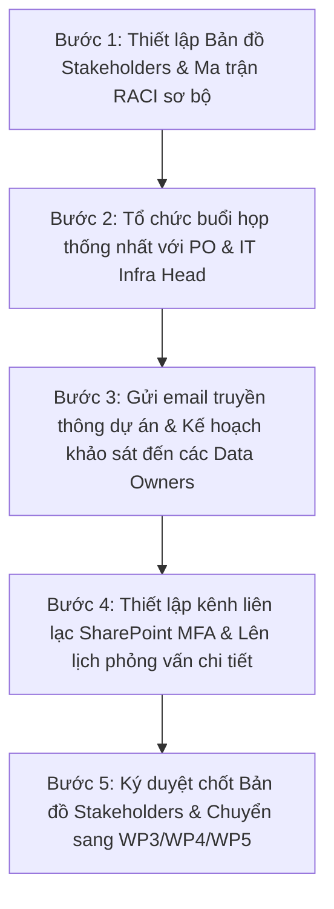

# Bản đồ Stakeholders và Ma trận RACI Kiến trúc Dữ liệu - FPT Long Châu

Tài liệu này xác định các bên liên quan cốt lõi sở hữu (Data Owners), vận hành nghiệp vụ (Data Stewards) và vận hành kỹ thuật (Data Engineers/DBAs) đối với tài sản dữ liệu của FPT Long Châu. Đồng thời thiết lập ma trận trách nhiệm RACI đối với các hoạt động quản trị, vận hành dữ liệu trong suốt chiến dịch khảo sát hiện trạng (Baseline Data Architecture) và giai đoạn vận hành sau này.

---

## 1. Mục tiêu và Phạm vi

### 1.1. Mục tiêu
- **Minh bạch hóa trách nhiệm**: Phân định rõ ràng vai trò sở hữu và quản trị dữ liệu ở cấp độ nghiệp vụ và kỹ thuật.
- **Tối ưu hóa quá trình khảo sát**: Xác định đúng đầu mối liên hệ cho từng hệ thống ứng dụng và miền dữ liệu (Domain) để thực hiện phỏng vấn và thu thập tài liệu kỹ thuật trong các gói công việc tiếp theo (WP3 - WP6).
- **Thiết lập nền tảng Quản trị Dữ liệu (Data Governance)**: Tạo cơ sở cho các quy trình kiểm soát chất lượng, bảo mật và tuân thủ Nghị định 13/2023/NĐ-CP đối với dữ liệu cá nhân của khách hàng.

### 1.2. Phạm vi
Bản đồ stakeholders và ma trận RACI này bao phủ 6 miền dữ liệu cốt lõi của FPT Long Châu:
1. **Sales & Retail Operations (POS)**
2. **Supply Chain & Logistics (WMS)**
3. **Customer Relationship & Loyalty (CRM & CDP)**
4. **Purchasing & Product Master (ERP)**
5. **Omnichannel & E-commerce (Web/App)**
6. **Data Platform & Analytics (DWH/Lakehouse)**

---

## 2. Định nghĩa các Vai trò trong Quản trị Dữ liệu (Data Roles)

Để áp dụng chuẩn xác ma trận RACI, FPT Long Châu định nghĩa các vai trò quản trị dữ liệu cốt lõi như sau:

- **Data Owner (Chủ sở hữu Dữ liệu)**: 
  - Là người đứng đầu bộ phận nghiệp vụ sinh ra hoặc sử dụng chính nguồn dữ liệu đó (thường là Trưởng phòng/Giám đốc chức năng).
  - Có thẩm quyền cao nhất trong việc phê duyệt mục đích sử dụng dữ liệu, cấp quyền truy cập, và phê duyệt các tiêu chuẩn chất lượng dữ liệu của miền nghiệp vụ đó.
  - Chịu trách nhiệm về tính tuân thủ pháp lý (như Nghị định 13/2023/NĐ-CP đối với dữ liệu khách hàng).
- **Data Steward (Người quản trị nghiệp vụ dữ liệu)**:
  - Là nhân sự thuộc bộ phận nghiệp vụ hoặc bộ phận phân tích dữ liệu, am hiểu sâu về ý nghĩa kinh doanh của dữ liệu.
  - Chịu trách nhiệm định nghĩa từ điển thuật ngữ nghiệp vụ (Business Glossary), xây dựng quy tắc chất lượng dữ liệu (Data Quality Rules), và hỗ trợ Data Owner kiểm tra tính chính xác của dữ liệu.
- **Data Engineer / DBA / System Admin (Kỹ sư Dữ liệu / Quản trị Cơ sở dữ liệu)**:
  - Phụ trách mặt kỹ thuật của dữ liệu (Database Administration, ETL/ELT pipelines, infrastructure).
  - Đảm bảo hệ thống hoạt động ổn định, thực hiện phân quyền truy cập vật lý theo phê duyệt của Data Owner, sao lưu dữ liệu, giám sát hiệu năng và triển khai kỹ thuật các quy tắc chất lượng dữ liệu.

---

## 3. Bản đồ Stakeholders theo Miền Dữ liệu (Data Ownership & Stewardship Map)

Dưới đây là chi tiết các stakeholders chịu trách nhiệm đối với từng miền dữ liệu và hệ thống tương ứng tại FPT Long Châu:

| STT | Miền dữ liệu (Data Domain) | Hệ thống cốt lõi | Chủ sở hữu dữ liệu (Data Owner) | Quản trị nghiệp vụ (Data Steward) | Vận hành kỹ thuật (Data Engineer / DBA) |
| :--- | :--- | :--- | :--- | :--- | :--- |
| 1 | **Sales & Retail Operations** | POS (Point of Sale), Retail Ops systems | **Trưởng phòng POS & Vận hành Bán lẻ** | Chuyên viên Nghiệp vụ POS (POS BA/Super User) | DBA POS & IT Retail Ops Support Team |
| 2 | **Supply Chain & Logistics** | WMS (Warehouse Management System), Logistics Routing | **Trưởng phòng Chuỗi cung ứng (Logistics & Supply Chain Head)** | Supply Chain Business Analyst (SCM Steward) | DBA WMS & Technical Support Engineer |
| 3 | **Customer CRM & Loyalty** | CRM, CDP (Customer Data Platform) | **Trưởng phòng Marketing & CRM** | CRM Manager & Customer Data Steward | CDP Data Engineer & DBA CRM |
| 4 | **Purchasing & Product Master** | ERP (e.g., SAP/Custom ERP) | **Trưởng phòng Mua hàng & Quản lý Sản phẩm (MDM Owner)** | MDM Specialist / ERP Functional BA | ERP Technical Lead & DBA ERP |
| 5 | **Omnichannel E-commerce** | Website Long Châu, Mobile App | **Trưởng phòng Thương mại Điện tử (E-commerce Head)** | E-commerce Operations Lead | Web/App Data Engineer & DevOps Team |
| 6 | **Data Platform & Analytics** | Data Lakehouse, Data Warehouse (DWH), BI Tools | **Product Owner / Head of Data (Khanh Hoa)** | Data Governance Officer & Analytics Lead | Lead Data Engineer & Platform Administrator |

---

## 4. Danh sách Đầu mối Liên hệ Chi tiết (Contact List)

| Họ và tên / Bộ phận | Vai trò Dự án | Miền phụ trách chính | Địa chỉ Email | Ghi chú đầu mối liên hệ |
| :--- | :--- | :--- | :--- | :--- |
| **Khanh Hoa** | Product Owner / Sponsor | Toàn bộ dự án | `khanhhoa@longchau.com` | Head of Data, phê duyệt các quyết định lớn về kiến trúc và tài chính. |
| **Trưởng phòng POS** | Domain Contact / Data Owner | Sales & Retail Ops | `retail.pos@longchau.com` | Cung cấp nghiệp vụ POS, phê duyệt truy cập schema POS. |
| **Trưởng phòng Chuỗi cung ứng** | Domain Contact / Data Owner | Supply Chain & Logistics | `supplychain@longchau.com` | Cung cấp nghiệp vụ kho vận WMS, xuất nhập tồn. |
| **Trưởng phòng Marketing & CRM** | Domain Contact / Data Owner | CRM & CDP | `marketing.crm@longchau.com` | Phụ trách dữ liệu khách hàng, hành vi mua sắm, tích điểm. Đầu mối chính về Nghị định 13. |
| **Trưởng phòng Mua hàng** | Domain Contact / Data Owner | ERP / Product Master | `purchasing@longchau.com` | Quản lý danh mục thuốc, nhà cung cấp, giá bán. |
| **Trưởng phòng E-commerce** | Domain Contact / Data Owner | Omnichannel Web/App | `ecom@longchau.com` | Phụ trách dữ liệu đơn hàng online, clickstream người dùng. |
| **Trưởng phòng Hạ tầng & DBA** | Infrastructure Head / Technical Owner | Cơ sở dữ liệu vật lý | `it.infra@longchau.com` | Đầu mối cấp tài khoản Read-only, backup, giám sát hiệu năng DB. |
| **Lead DBA** | Database Administrator | Quản trị DB Vật lý | `dba@longchau.com` | Phụ trách xuất schema DDL, cấp quyền truy cập Staging/Sandbox cho khảo sát. |
| **ea_consultant** | EA Consultant (Leader) | Quản lý & Mô hình hóa | `ea_consultant@multica.ai` | Điều phối chung, tổng hợp tài liệu Baseline Data Architecture. |
| **data_architect** | Data Architect | Khảo sát & Mô hình hóa | `data_architect@multica.ai` | Khảo sát danh mục DB, schema, từ điển và vẽ sơ đồ ArchiMate. |
| **data_engineer** | Data Engineer | Khảo sát Luồng tích hợp | `data_engineer@multica.ai` | Khảo sát pipelines, ETL/ELT jobs, Message Queues và vẽ Data Lineage. |
| **ea_security_architect** | Enterprise Security Architect | Bảo mật & Tuân thủ NĐ 13 | `security_arch@multica.ai` | Đánh giá an toàn thông tin, masking, mã hóa và khoảng trống Nghị định 13. |
| **Legal & Compliance Dept.** | Compliance Advisor | Tuân thủ Pháp lý | `legal@longchau.com` | Hỗ trợ tham vấn về các điều khoản pháp lý liên quan đến Nghị định 13/2023/NĐ-CP. |

---

## 5. Ma trận RACI Hoạt động Quản trị Dữ liệu (Data Governance RACI Matrix)

Ma trận dưới đây định nghĩa trách nhiệm của các bên liên quan đối với các hoạt động quản trị dữ liệu cốt lõi tại FPT Long Châu trong và sau dự án:

- **R (Responsible)**: Người trực tiếp thực hiện công việc.
- **A (Accountable)**: Người chịu trách nhiệm phê duyệt cuối cùng và có tiếng nói quyết định.
- **C (Consulted)**: Người được hỏi ý kiến, tham vấn thông tin.
- **I (Informed)**: Người được thông báo kết quả sau khi hoàn thành.

| STT | Hoạt động Quản trị Dữ liệu | Product Owner (Sponsor) | EA Consultant (Leader) | Data Architect | Data Engineer | Security Architect | Data Owner | Data Steward | Lead DBA / IT Infra | Legal & Compliance |
| :--- | :--- | :---: | :---: | :---: | :---: | :---: | :---: | :---: | :---: | :---: |
| 1 | **Quản lý Vòng đời Dữ liệu (Lifecycle)** | I | C | R | C | C | **A** | R | R | C |
| 2 | **Quản lý Chất lượng Dữ liệu (Data Quality)** | I | C | C | R | I | **A** | R | C | I |
| 3 | **Từ điển & Siêu dữ liệu (Dictionary & Metadata)**| I | C | R | C | I | **A** | R | C | I |
| 4 | **Bảo mật & Cấp quyền truy cập (Access Control)**| C | I | I | I | R | **A** | C | R | C |
| 5 | **Tuân thủ Nghị định 13/2023/NĐ-CP** | C | I | C | I | R | **A** | C | I | **R** |
| 6 | **Tích hợp & Vận hành Luồng dữ liệu (ETL)** | I | C | C | R | C | I | C | **A** / R | I |
| 7 | **Dữ liệu Master (MDM - Product, Customer)** | I | C | R | C | I | **A** | R | C | I |
| 8 | **Thực hiện Khảo sát Kiến trúc hiện trạng** | **A** | R | R | R | R | C | C | C | I |

> [!NOTE]
> - Đối với việc phê duyệt an toàn và cấp quyền truy cập (Dòng 4), **Data Owner** luôn giữ vai trò phê duyệt cao nhất (**A**) về mặt nghiệp vụ kinh doanh đối với dữ liệu họ sở hữu. Bộ phận **IT Infra/DBA** chịu trách nhiệm thực hiện kỹ thuật (**R**), và **Security Architect** thiết lập chính sách kiểm soát (**R**).
> - Trong công tác tuân thủ Nghị định 13/2023/NĐ-CP (Dòng 5), **Legal & Compliance** giữ vai trò chủ trì soạn thảo khung và điều khoản pháp lý (**R**), **Security Architect** thiết kế giải pháp kỹ thuật bảo vệ (**R**), còn **Data Owner** chịu trách nhiệm tối cao (**A**) đối với dữ liệu cá nhân phát sinh trong domain nghiệp vụ của mình.

---

## 6. Kế hoạch và Quy trình phối hợp WP2

Để hoàn tất gói công việc WP2 và tạo bàn đạp cho các WP khảo sát kỹ thuật tiếp theo, EA Team sẽ triển khai các bước phối hợp như sau:

### 6.1. Quy tắc liên lạc an toàn thông tin đối với Stakeholders
- Toàn bộ liên lạc qua email phải dùng email doanh nghiệp có tên miền `@fpt.com` hoặc `@longchau.com`.
- Không gửi sơ đồ mạng, schema, tài liệu kỹ thuật qua các ứng dụng chat công cộng (Zalo, Viber, Telegram, v.v.). Chỉ sử dụng Microsoft Teams nội bộ hoặc SharePoint được bảo vệ bởi MFA.
- Khi phỏng vấn hoặc gửi câu hỏi khảo sát, tuyệt đối chỉ tập trung vào cấu trúc (Metadata, Tables, Fields) và quy trình, không được phép hỏi hoặc ghi chép dữ liệu giao dịch thực tế của khách hàng.
